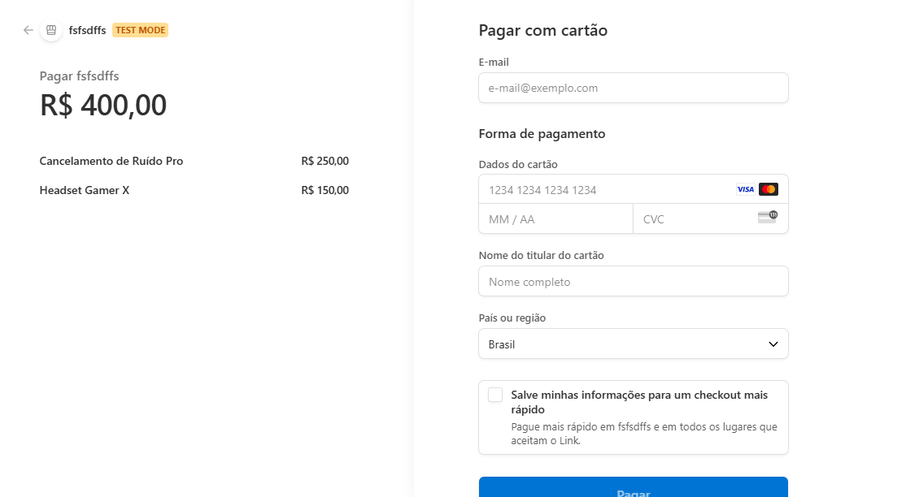
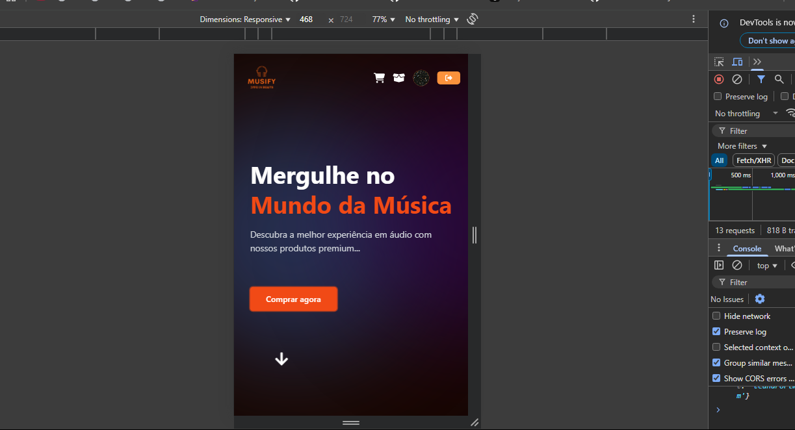

# 🎧 Musicfy


**Musicfy** é uma aplicação moderna de e-commerce voltada para produtos de áudio, como fones de ouvido, caixas de som e acessórios. Com uma interface elegante, intuitiva e 100% responsiva, oferece uma experiência de compra completa, desenvolvida com **React**, **TypeScript** e **Vite**.

---

## 🚀 Demo ao Vivo

**[Acesse a demonstração ao vivo aqui](musicfy-two.vercel.app
)**

---

## ✨ Funcionalidades

- 🔐 **Autenticação de Usuário**
  - Login/registo com e-mail e senha ou autenticação via Google.
  - 

- 🛍️ **Catálogo de Produtos**
  - Lista de produtos com imagens, descrições e preços.
  - 

- 🛒 **Carrinho de Compras Dinâmico**
  - Adicione, remova e ajuste a quantidade dos itens em tempo real.
  - 

- 💳 **Checkout com Stripe**
  - Pagamento seguro com integração Stripe.
  - 

- 📦 **Histórico e Rastreamento de Pedidos**
  - Consulte pedidos anteriores e acompanhe o status de entrega.
  - 

- 📱 **Design Responsivo**
  - Totalmente adaptável a desktops, tablets e smartphones.
  - 

---

## ⚙️ Tecnologias Utilizadas

### 💻 Frontend
- **React** + **TypeScript**
- **Vite** (build rápida e leve)
- **Tailwind CSS** (estilização moderna e eficiente)
- **Framer Motion**, **React Icons**, **Font Awesome** (animações e ícones)

### 🔄 Gestão de Estado
- **React Context API**

### 🔔 Notificações
- **React Toastify**

### 🔐 Autenticação
- **Firebase Authentication**

### 🌐 Comunicação com o Backend
- **Fetch API**

---

## 📂 Estrutura do Projeto

O projeto está organizado da seguinte forma:

```
/src
|-- /components     # Componentes reutilizáveis (Navbar, Footer, etc.)
|-- /contexts       # Contextos da aplicação (CartContext)
|-- /hooks          # Hooks customizados (useAuth, useProducts)
|-- /Pages          # Páginas principais da aplicação (Login, Cart, etc.)
|-- /services       # Funções para comunicação com APIs (cartApi, CEPservice)
|-- /assets         # Imagens e outros recursos estáticos
|-- App.tsx         # Componente principal e gestor de rotas
|-- main.tsx        # Ponto de entrada da aplicação
|-- firebase.ts     # Configuração do Firebase
|-- index.css       # Estilos globais com Tailwind
```

---

## 🚀 Começando

### ✅ Pré-requisitos
- Node.js v14 ou superior
- npm ou yarn instalado

### 🔧 Instalação

1.  Clone o repositório:
    ```bash
    git clone [https://github.com/jleandromorais/musicfy.git](https://github.com/jleandromorais/musicfy.git)
    ```

2.  Acesse o diretório:
    ```bash
    cd musicfy
    ```

3.  Instale as dependências:
    ```bash
    npm install
    # ou
    yarn install
    ```

### 🔑 Configuração do Firebase

Para que a autenticação e outros serviços do Firebase funcionem, precisa de criar um ficheiro `.env.local` na raiz do projeto e adicionar as suas credenciais do Firebase, baseando-se no ficheiro `src/firebase.ts`.
