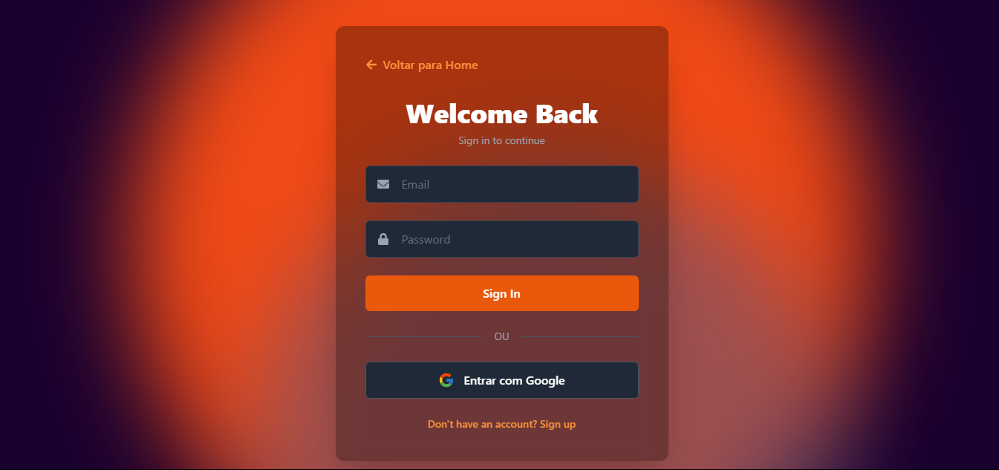
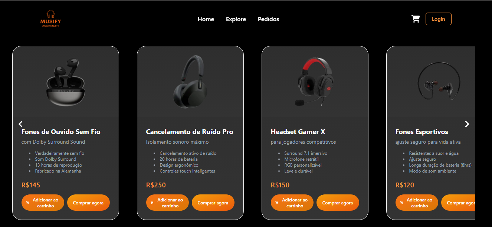
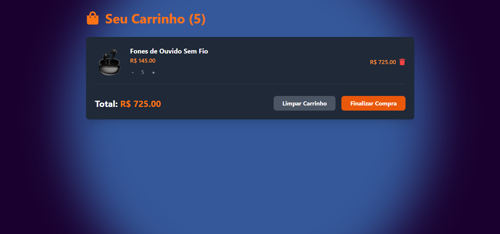

# 🎧 Musicfy

Musicfy é uma aplicação de e-commerce moderna focada em produtos de áudio como fones de ouvido, caixas de som e acessórios. Com uma interface intuitiva, responsiva e elegante, oferece uma experiência de compra completa desenvolvida com **React**, **TypeScript** e **Vite**.


---

## ✨ Funcionalidades

- 🔐 **Autenticação de Usuário**
  - Login/registro com e-mail/senha ou Google.
    

- 🛍️ **Catálogo de Produtos**
  - Navegue por uma seleção de produtos com imagens, descrições e preços.
  - 
- 🛒 **Carrinho de Compras Dinâmico**
  - Adição, remoção e ajuste de quantidades em tempo real.
  - 
- 💳 **Checkout com Stripe**
  - Pagamento seguro e processo simplificado.
- 📦 **Histórico & Rastreamento de Pedidos**
  - Visualize pedidos anteriores e acompanhe entregas.
- 📱 **Design 100% Responsivo**
  - Compatível com desktop, tablets e smartphones.

---

## ⚙️ Tecnologias Utilizadas

### 🧠 Frontend
- **React** + **TypeScript**
- **Vite** para build rápida e leve
- **Tailwind CSS** para estilização
- **Framer Motion**, **React Icons**, **Font Awesome** para animações e ícones

### 🔄 Gerenciamento de Estado
- **React Context API**

### 🔔 Notificações
- **React Toastify**

### 🔐 Autenticação & Backend
- **Firebase Authentication**

### 🌐 Comunicação com Backend
- **Fetch API**

---

## 🚀 Começando

### ✅ Pré-requisitos

- Node.js 14+
- npm ou yarn

### 🔧 Instalação

```bash
# Clone o repositório
git clone https://github.com/jleandromorais/musicfy.git

# Acesse o diretório
cd musicfy

# Instale as dependências
npm install
